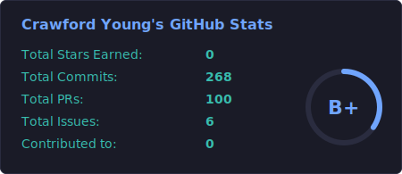
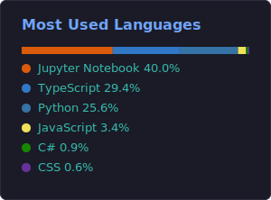
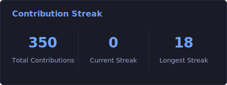
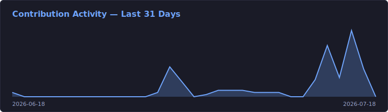
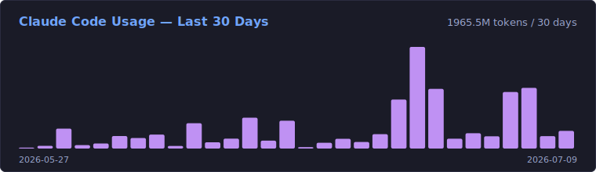

<h1 align="center">Hi, I'm Crawford Young 👋</h1>

  AI/Software Engineer at Aderant &nbsp;·&nbsp; Auburn CS Grad

  
  &nbsp;
  

---

### About Me

- 🎓 BS Computer Science · Undergraduate Certificate in AI Engineering · Honors Scholar
- 💼 Software Engineer at Aderant
- 🏆 Ex-Web Dev Club President · Ex-Competitive Programming Team Member · Ex-FloQast Intern

---

### GitHub Stats

  
  

  

  

  

All cards generated daily by <a href="./src">our own code</a> — no third-party image services.

---

### Tech Stack

  
  
  
  
  
  
  
  

---

### Currently Working On

- [Scheduling Assistant](https://github.com/Crawford-Young/scheduling-advisor) — AI-powered scheduling tool
- [Personal Component Library](https://github.com/Crawford-Young/component-library)
- [Portfolio Website](https://crawfordyoung.dev)

---

### Other Projects

| Project | Description |
|---|---|
| [Instrument Tuner](https://github.com/Crawford-Young/InstrumentTuner) | Audio-based instrument tuning tool |
| [AI Pacman](https://github.com/Crawford-Young/AI-Pacman) | AI agents playing Pacman |
| [AI Chess Puzzle Generator](https://github.com/Crawford-Young/ChessBot) | Chess puzzle generation via AI |
| [Idle Game](https://github.com/Crawford-Young/Idle_Game) | Basic HTML idle game |
